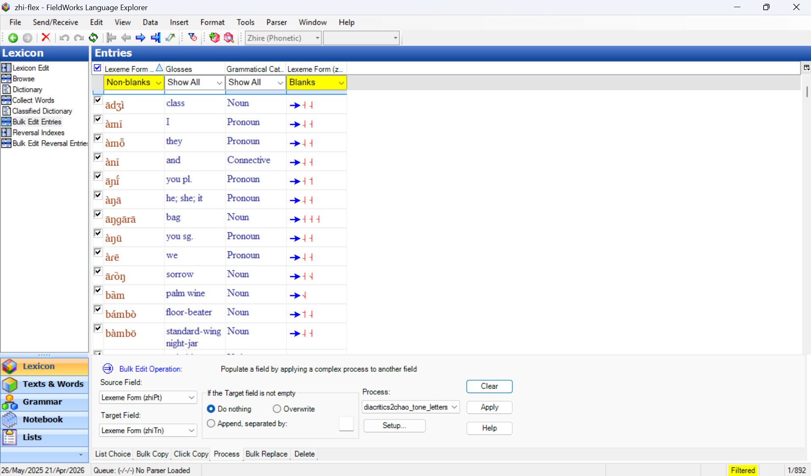

# flex-string-converters

String converters for linguistic data. The primary way to use one is directly inside SIL FieldWorks Language Explorer (FLEx), as a **FLEx Process** run over a whole column of lexicon data with no extra installation step. Each converter also runs from the command line on its own, and — for the ones with a module file — as a [FlexTools](https://github.com/cdfarrow/flextools) module that walks the whole lexicon with richer reporting.

That's possible because every converter is a plain Python 3 file with a `Convert()` function that takes a string and returns a string, with no FieldWorks dependency. Converters are grouped into **project folders** at the repository root, one per topic or language community — `chao-tone-letters/` below is the main one in active use; `zhire/` mainly illustrates what's possible for a specific language's own orthography.

These modules are in development. **Please back up your FLEx project before running any of them** — FLEx has no undo across a FlexTools run.

## Running as a FLEx Process

FLEx's own Bulk Edit → Process feature can run one of these converters directly on a field's text, with no FlexTools installation involved. Pick a source and target field, choose the converter from the Process list (using Setup… to point it at the converter file if it isn't listed yet), and Apply:



This screenshot shows the Zhire lexicon's Bulk Edit Entries view, with the Process tab populating a blank `Lexeme Form (zhiTn)` field from the phonetic `Lexeme Form (zhiPt)` field, using the `diacritics2chao_tone_letters_only` process — one of `chao-tone-letters/`'s converters, described below.

This runs your system's own Python 3, not one bundled with FLEx, so it needs Python 3 installed and reachable from FLEx, and any third-party package the chosen converter needs — `regex` for the `chao-tone-letters` converters, `pynini` for the `zhire` ones — installed into that same Python 3 with `pip install <package>` first. Each converter's section below names the packages it needs.

## `chao-tone-letters/`

Converting between tone diacritics and Chao tone letters. Not specific to any one language.

### `diacritics2chao.py`

Strips tone diacritics from the input and appends its Chao tone letters, e.g. `nə̀jɛ᷅t` → `nəjɛt ˨ ˨˧`. As a FLEx Process this is the `diacritics2chao` process. Point at `diacritics2chao_attached.py` instead for the `--attached` form below, or `diacritics2chao_tone_letters_only.py` for the tone letters alone with no base text — a raw FLEx Process always calls a bare `Convert(input_string)`, so these thin wrapper files are how it reaches those variants.

`--attached` writes each tone letter after the syllable it marks instead of gathering them into a trailing section. That form carries no meaning in its spacing, so unlike the default it survives a pipeline, spreadsheet or copy-paste that collapses runs of spaces:

```
$ python3 chao-tone-letters/converters/diacritics2chao.py --attached 'nə̀jɛ᷅t'
nə˨jɛ˨˧t
```

It needs Python 3 and the `regex` package (`pip install regex`); FieldWorks is not required to run it from the command line.

It's also available as the FlexTools module `Extract_Chao_tone_letters_from_tone_diacritics.py`, which runs it over every lexeme form in the lexicon and writes the result into a custom `Pitch` field — see [chao-tone-letters/SPEC.md](chao-tone-letters/SPEC.md) for its prerequisites (a `Pitch` custom field, the vernacular writing system) and what it does to existing `Pitch` values.

### `chao2diacritics.py`

Reverses `diacritics2chao.py`: places Chao tone letters back onto their base text as tone diacritics, e.g. `nəjɛt ˨ ˨˧` → `nə̀jɛ᷅t`. As a FLEx Process this is the `chao2diacritics` process — there is no FlexTools module for this direction yet (see [chao-tone-letters/SPEC.md's Not Yet Specified section](chao-tone-letters/SPEC.md#not-yet-specified)).

Where the tone letters sit doesn't matter — attached to their syllable, gathered before or after the text, or a mixture all give the same result — so a spreadsheet or copy-paste that collapses or adds spaces can't change the reading. A line that doesn't correspond to a valid tone-letter reading (an unaccounted syllable, or a contour with no diacritic equivalent) is returned unchanged rather than partially converted, with a warning to stderr naming the line, so the exit status stays 0 and an existing pipeline doesn't break:

```
$ python3 chao-tone-letters/converters/chao2diacritics.py 'ma ti ˦  ˦˨' 'ma˦ ti˦˨'
má tî
má tî
```

It needs the same `regex` package as `diacritics2chao.py`.

## `zhire/`

A second, smaller project — mainly here to illustrate what's possible for a language with its own orthography, rather than the day-to-day tool the `chao-tone-letters/` converters above are. It converts a Zhire `[zhi]` phonetic or phonemic transcription to its orthographic spelling; the two converters compose: phonetic → phonemic → orthography.

`phonetic2phonemic.py` applies the Zhire phonology sketch's allophony and notation rules to turn a phonetic transcription into a phonemic one, e.g. `ɲápsə́` → `njápsə́` (the `phonetic2phonemic` FLEx Process). `phonemic2orthography.py` then strips tone diacritics (the orthography has no tone-marking convention yet) and maps the phonemic string to its orthographic spelling, e.g. `hwōrì` → `whori` (the `phonemic2orthography` FLEx Process). Both raise an error naming the offending input if a symbol or sequence isn't covered, rather than passing it through unchanged or dropping it silently.

Both need Python 3 and the `pynini` package (`pip install pynini`) — prebuilt wheels exist for Linux; macOS and Windows need conda-forge, and Windows has no native wheel at all (install via WSL there). There is no FlexTools module for either, since FlexTools runs under Python .NET/IronPython on Windows and `pynini` doesn't support that — but both still work as a FLEx Process, subject to the same platform caveats, since a FLEx Process runs a real Python 3 rather than FlexTools' bundled one.

## Adding a new converter

1. Decide whether it belongs in an existing project folder or needs a new one. For a new project folder, see the [`adding-a-project`](.claude/skills/adding-a-project/SKILL.md) skill, which scaffolds `<project>/{SPEC.md, converters/, tests/}`.
2. Add `<project>/converters/<what_it_converts>.py` with a `Convert(input_string)` function and a command line interface, and no `flextoolslib` or FieldWorks import.
3. Add `<project>/tests/test_<what_it_converts>.py` covering `Convert()` directly, and once the CLI has realistic output, approval fixtures under `<project>/tests/fixtures/<what_it_converts>/` (see [`adding-an-approval-fixture`](.claude/skills/adding-an-approval-fixture/SKILL.md)).
4. If it should run over a whole lexicon as a FlexTools module, follow the [`adding-a-flextools-module`](.claude/skills/adding-a-flextools-module/SKILL.md) skill to wrap it starting from `__Template_converter_module.py`.
5. Update the project's `SPEC.md` (and the root [SPEC.md](SPEC.md) index, if it's a new project) and this README in the same change.

See [AGENTS.md](AGENTS.md) for the full contributor conventions and [SPEC.md](SPEC.md) for the index of what each project's converters and modules guarantee.

## Tests

Run `python -m pytest` from the repository root, which discovers every project's own `tests/` folder in one run, plus the repository-wide `tests/` holding only the shared approval-testing harness. All of it runs on any platform: converter tests need no FLEx project, and module tests stub `flextoolslib` and drive `MainFunction` with a fake project and report object.

`diacritics2chao.py`'s and `chao2diacritics.py`'s CLIs are additionally covered end to end by approval tests — input fixtures and their approved outputs under each converter's `tests/fixtures/<converter>/`, compared exactly with no scrubbing or Unicode normalisation. See [AGENTS.md's Testing Approach](AGENTS.md#testing-approach) for the full convention, and the [`adding-an-approval-fixture`](.claude/skills/adding-an-approval-fixture/SKILL.md) skill for adding a fixture or approving a changed one.

## Related

`Extract_Chao_tone_letters_from_tone_diacritics.py` was extracted from [flextools_modules](https://github.com/speechchemistry/flextools_modules), which keeps a mirrored copy for now (still under this module's old name). **This repository is the canonical one.** Modules that walk the FLEx model rather than transform a string — such as `Fix_Pronunciation_Media_Paths.py` — stay there.

Attributions: This repository includes code from C D Farrows (licensed under LGPL 2.1) in `Extract_Chao_tone_letters_from_tone_diacritics.py`, so that file's licence is LGPL 2.1. Please see the source code for more attribution information.
